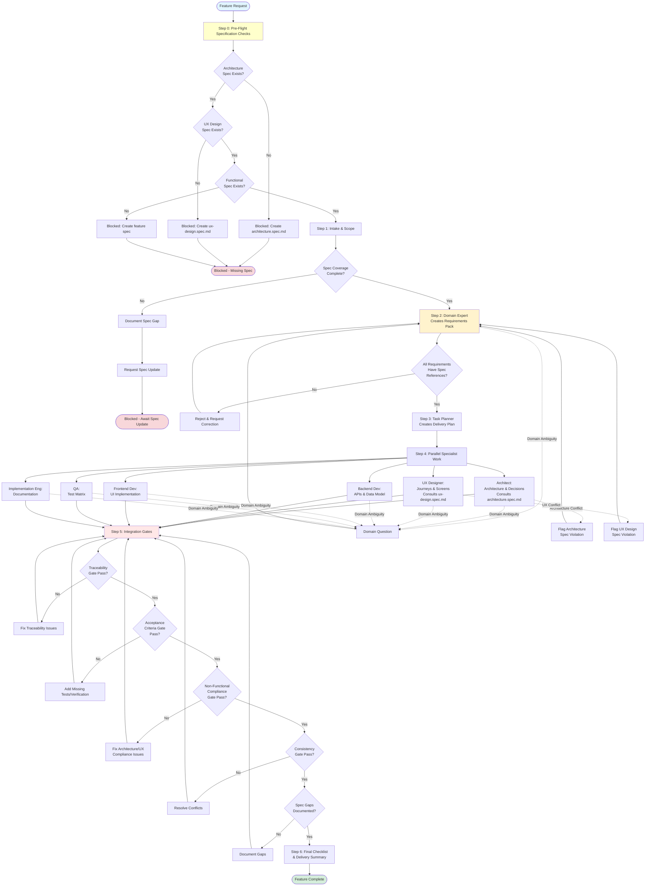

# Development Process Orchestration

## Overview

This document outlines how feature development is orchestrated across our specialized team. The Product Owner coordinates work across multiple specialist agents to ensure requirements are met, quality is maintained, and all work is traceable to specifications.

## Team Structure

Our development team consists of specialized roles:

- **Product Owner (Orchestrator)** - Coordinates workflow and ensures acceptance criteria are met
- **Domain Expert** - Interprets business domain and extracts requirements from specs
- **Task Planner** - Creates delivery plans with milestones and dependencies
- **Architect** - Designs system architecture and key technical decisions
- **UX Designer** - Creates user journeys and interaction designs
- **Frontend Developer** - Implements UI and client-side logic
- **Backend Developer** - Implements APIs, business logic, and data persistence
- **Quality Assurance** - Creates test matrices and verification strategies
- **Implementation Engineer** - Produces documentation, deployment guides, and operational notes

## Core Principles (Hard Rules)

### 1. Source of Truth: `/specs`
All requirements must be traceable to files in the `/specs` directory. No work proceeds without specification backing.

Specifications are organized by type:
- **Non-Functional Specifications** (`/specs/non-functional/`) - Cross-cutting concerns like architecture and UX design that apply to all features
- **Functional Specifications** (`/specs/functional/`) - Specific features and business capabilities

### 2. Domain Expert Authority
Only the Domain Expert can interpret business domain concepts. All other team members are domain-agnostic and must consult the Domain Expert for domain clarification.

### 3. No Invented Requirements
If a requirement cannot be supported by existing specs:
- Treat it as a **spec gap**
- Document the gap
- Request a spec update before proceeding

## Development Workflow

### Step 0: Pre-Flight Specification Checks

**Objective:** Verify all mandatory specifications exist before any work begins

**BLOCKING REQUIREMENT:** Work cannot proceed unless all required specifications exist.

#### Mandatory Non-Functional Specifications

These cross-cutting specifications MUST exist before any feature work:

- ✅ **`/specs/non-functional/architecture.spec.md`**
  - Mandated technology stack
  - Architectural patterns and layering requirements
  - API design standards
  - Security and compliance requirements
  - Infrastructure as Code guidelines
  - CI/CD pipeline standards
  - Performance targets

- ✅ **`/specs/non-functional/ux-design.spec.md`**
  - Visual design system (colors, typography, spacing)
  - Component library specifications
  - Interaction patterns and states
  - Accessibility standards (WCAG compliance)
  - Responsive design requirements

**If either specification is missing:**
1. STOP immediately
2. Document which specification is missing
3. Request specification creation
4. Do not proceed to Step 1 until specifications exist

#### Mandatory Functional Specification

At least one feature specification MUST exist in `/specs/functional/`:

- ✅ **`/specs/functional/<feature-name>.spec.md`**
  - Feature overview and business purpose
  - Domain glossary
  - Functional requirements with acceptance criteria
  - API contracts (if applicable)
  - Business rules and validation logic
  - User interaction flows

**If no functional specification exists for the requested feature:**
1. STOP immediately
2. Request functional specification creation
3. Do not proceed to Step 1 until specification exists

**Verification Checklist:**

```
☐ Architecture specification exists and is current
☐ UX design specification exists and is current
☐ Functional specification exists for target feature
☐ All specifications have version numbers and last updated dates
☐ No conflicting definitions across specifications
```

**Only proceed to Step 1 when all checks pass.**

---

### Step 1: Intake and Scope

**Objective:** Understand what change is being requested

**Prerequisites:** Step 0 Pre-Flight Checks passed

**Activities:**
- Identify the target outcome (what feature or change is requested)
- Confirm which functional specification covers this work (from `/specs/functional/`)
- Identify any additional non-functional concerns (reference `/specs/non-functional/`)
- Verify specification coverage is complete

**If specification gaps are discovered:**
- Document the gap specifically
- Identify which specification needs updating (functional or non-functional)
- Stop work and request specification update
- Return to Step 0 after specification is updated

**Output:**
- Clear statement of what needs to be built
- Primary functional specification reference: `/specs/functional/<feature-name>.spec.md`
- Referenced non-functional specifications:
  - Architecture spec (always referenced)
  - UX design spec (always referenced for UI work)
- List of specific sections within each spec that apply

---

### Step 2: Requirements Pack (Domain Expert)

**Objective:** Extract and document requirements from specifications

**Activities:**
- Domain Expert reviews relevant specs
- Extracts requirements with full traceability
- Identifies ambiguities and gaps

**Required Output Format:**
```
Requirements Pack
├── Spec Sources Used
│   ├── Functional Specs:
│   │   └── /specs/functional/<feature>.spec.md#<heading>
│   └── Non-Functional Specs:
│       ├── /specs/non-functional/architecture.spec.md#<heading> (if referenced)
│       └── /specs/non-functional/ux-design.spec.md#<heading> (if referenced)
├── Glossary
│   └── Terms and definitions (with spec references to functional specs)
└── Requirements
    └── For each requirement:
        ├── ID (e.g., REQ-001)
        ├── Type (Functional or Non-Functional)
        ├── Summary
        ├── Spec Reference (/specs/<category>/<file>#<heading>)
        ├── Acceptance Criteria (testable)
        ├── Open Questions (if specs unclear)
        └── Spec Gaps (what is missing and where)
```

**Quality Gate:**
- Every requirement must have a spec reference
- Reject requirements without traceability

---

### Step 3: Delivery Plan (Task Planner)

**Objective:** Create actionable work breakdown

**Input:**
- Requirements Pack from Domain Expert

**Activities:**
- Break work into milestones
- Map work items to requirement IDs
- Identify dependencies and sequencing
- Suggest parallel work streams

**Required Output Format:**
```
Delivery Plan
├── Milestones
│   └── [Milestone name, requirements covered]
├── Work Items
│   └── [Item mapped to requirement IDs]
├── Dependencies and Sequencing
│   └── [What must happen before what]
├── Parallelization Opportunities
│   └── [What can happen simultaneously]
└── Definition of Done
    └── [Per milestone]
```

---

### Step 4: Parallel Specialist Work

**Objective:** All specialists work simultaneously with same requirements pack

Each specialist receives:
- Requirements Pack
- Delivery Plan
- Their specific scope

#### Architect

**Input Requirement:**
- MUST consult `/specs/non-functional/architecture.spec.md` before all decisions
- All architectural decisions must comply with mandated technology stack and patterns

**Deliverables:**
- Architecture outline and key decisions
- Interfaces and boundaries
- Cross-cutting concerns (security, logging, etc.)
- Risks and mitigations
- **Flag any conflicts with requirements**
- **Flag any conflicts with architecture specification**

#### UX Designer

**Input Requirement:**
- MUST consult `/specs/non-functional/ux-design.spec.md` before all decisions
- All design decisions must comply with design system and accessibility standards

**Deliverables:**
- User journeys and screen flows
- Design system impacts (or confirmation of existing patterns)
- Interaction patterns and states
- All tied to acceptance criteria
- **Flag any conflicts with UX design specification**

#### Backend Developer

**Deliverables:**
- API endpoints and contracts (mapped to requirements)
- Persistence and data model changes
- Error handling strategy
- Non-functional considerations

#### Frontend Developer

**Deliverables:**
- UI implementation plan (mapped to UX outputs and requirements)
- State management approach
- Integration points with backend

#### Quality Assurance

**Deliverables:**
- Test matrix mapping acceptance criteria to tests:
  - Unit tests
  - Integration tests
  - Frontend (UI or end-to-end) tests
- Test data requirements
- Environment needs

#### Implementation Engineer

**Deliverables:**
- Quickstart guide updates
- Install and run instructions
- Operational notes and troubleshooting
- User guide sections (mapped to requirements)

---

### Step 5: Integration Gates

**Objective:** Verify completeness before acceptance

**No work is accepted until all gates pass:**

1. **Traceability Gate**
   - Every requirement ID maps to:
     - Code changes (frontend and/or backend)
     - Tests (QA coverage)
     - Documentation (where applicable)
   - All requirements trace to functional specs in `/specs/functional/`

2. **Acceptance Criteria Gate**
   - All acceptance criteria covered by tests or explicit verification steps
   - Test results demonstrate spec compliance

3. **Non-Functional Compliance Gate**
   - Architecture implementation verified against `/specs/non-functional/architecture.spec.md`:
     - Technology stack compliance
     - Layering and dependency rules followed
     - API design standards adhered to
     - Security requirements met
   - UX implementation verified against `/specs/non-functional/ux-design.spec.md`:
     - Design system compliance
     - Component usage correct
     - Accessibility standards met
     - Interaction patterns followed

4. **Consistency Gate**
   - No unresolved conflicts between UX, architecture, and implementation plans
   - Documentation consistency verified:
     - No redundant specifications between `/specs` and `/docs`
     - Design decisions documented in only one authoritative location
     - Implementation guidance in `/docs` references `/specs` (never duplicates)
     - Conflicts flagged and resolved

5. **Spec Gaps Gate**
   - All spec gaps documented
   - Categorized by type (functional or non-functional)
   - Routed to appropriate spec update process

---

### Step 6: Final Checklist

**Objective:** Confirm delivery and handoff

**Product Owner produces:**

```
Delivery Summary
├── Completed Requirements
│   └── [List of IDs with links to artifacts]
├── Code Changes
│   └── [Files changed, PRs created]
├── Test Coverage Summary
│   └── [Pass/fail, coverage metrics]
├── Documentation Updates
│   └── [Docs modified or created]
└── Open Items
    └── [Remaining questions or spec gaps]
```

---

## Handling Blockers

**When blocked due to domain ambiguity:**

1. Route question to Domain Expert
2. Provide:
   - Exact spec section that is unclear
   - Specific question or ambiguity
3. Domain Expert responds with either:
   - Interpretation supported by existing spec text, or
   - Proposed update to `/specs` to remove ambiguity

**No work proceeds on ambiguous requirements.**

---

## Typical Feature Flow Diagram

The following diagram illustrates how a typical feature request flows through our orchestrated process:



---

## Key Success Factors

### 1. Specification-Driven Development
Every decision traces back to `/specs`. This ensures consistency, accountability, and prevents scope creep.

### 2. Clear Role Boundaries
Each specialist focuses on their domain of expertise. The Product Owner orchestrates but does not tell specialists how to do their work.

### 3. Parallel Execution
Step 4 allows multiple specialists to work simultaneously, reducing overall cycle time while maintaining quality.

### 4. Quality Gates Before Integration
Step 5 gates prevent incomplete or inconsistent work from being accepted, reducing rework and technical debt.

### 5. Continuous Traceability
From requirements to code to tests to documentation, every artifact links back to its originating requirement and specification.

---

## FAQs

**Q: What if a requirement seems obvious and doesn't need a spec?**  
A: All requirements must be in `/specs`. If something is obvious, it should be quick to document. This maintains our single source of truth.

**Q: Can a developer suggest an improvement not in the specs?**  
A: Yes, but it must go through the spec update process first. Determine if it's a functional improvement (add to feature spec in `/specs/functional/`) or a non-functional improvement (add to `/specs/non-functional/`). Document it as a spec gap and route it appropriately.

**Q: What's the difference between functional and non-functional specs?**  
A: 
- **Functional specs** (`/specs/functional/`) define WHAT we build - specific features, user stories, business capabilities
- **Non-functional specs** (`/specs/non-functional/`) define HOW we build - architecture, design system, security, performance standards that apply to all features

**Q: What if I need to update a non-functional spec?**  
A: Non-functional spec changes affect all features. Document the proposed change, assess impact across all existing features, and get Product Owner approval before proceeding.

**Q: What if the Domain Expert is unsure about something?**  
A: Document it as an open question or spec gap. Identify which spec needs clarification (functional or non-functional). Either clarify the spec or escalate for a spec amendment.

**Q: How do we handle urgent hotfixes?**  
A: Same process, accelerated timeline. The Step 0 pre-flight checks are NON-NEGOTIABLE even for hotfixes. If specs exist, proceed quickly through steps. The workflow ensures quality even under pressure.

**Q: What if specialists disagree on an approach?**  
A: The Product Owner identifies the conflict and routes it to the Domain Expert if it's domain-related (functional), to the Architect if it's architecture-related (non-functional), or to the UX Designer if it's design-related (non-functional). Specs are the tiebreaker.

**Q: Can we have multiple functional specs?**  
A: Yes! As features grow, create separate functional specs for each major feature or bounded context in `/specs/functional/`. Non-functional specs should remain few and comprehensive.

**Q: What if a requirement conflicts with a non-functional spec?**  
A: The non-functional spec wins unless there's a compelling reason to change it. Document the conflict, escalate to Product Owner. Changing non-functional specs requires impact assessment across all features.

---

## Conclusion

This orchestrated process ensures:
- **Specification Integrity**: Mandatory pre-flight checks ensure foundational specs exist before work begins
- **Clear Categorization**: Functional vs non-functional specs provide clear separation of concerns
- **Traceability**: Every line of code ties to a requirement and specification with full path references
- **Quality**: Multiple gates catch issues before integration, including compliance with non-functional standards
- **Efficiency**: Parallel work streams reduce cycle time while maintaining architectural and design consistency
- **Consistency**: All team members work from the same requirements pack and reference the same authoritative specs
- **Accountability**: Clear roles and deliverables for each specialist, with mandatory spec consultation

**Key Safeguards:**
1. **No work without specs** - Step 0 pre-flight checks are non-negotiable
2. **Non-functional specs are foundational** - Architecture and UX design specs must exist and be consulted
3. **Functional specs define the domain** - Feature requirements traced to functional specs
4. **Specs are authoritative** - When in conflict, specs win; when unclear, specs are amended

By following this process, we deliver features that meet specifications, comply with architectural and design standards, pass quality gates, and are fully documented for deployment and maintenance.

By following this process, we deliver features that meet specifications, pass quality gates, and are fully documented for deployment and maintenance.
